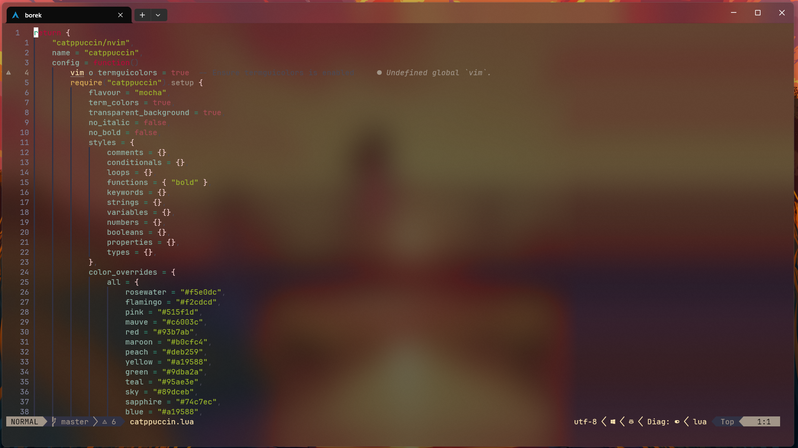

# My personal nvim config

Currently optimized for Arch on wsl in Windows terminal or Wezterm



## Installation - Arch linux on Windows wsl2


Powershell - Install archlinux on wsl

```powershell
wsl --install -d archlinux
```

Install all dependencies + nvim

```bash
sudo pacman -Syu --noconfirm --needed base-devel git curl wget unzip ripgrep fd nodejs npm python python-pip gcc make cmake neovim
```

Get my config

```bash
git clone https://github.com/BorekSaheli/nvim.git ~/.config/nvim
```


(Optional) clipboard fix
```bash
sudo pacman -S xclip
sudo pacman -S xsel
```

